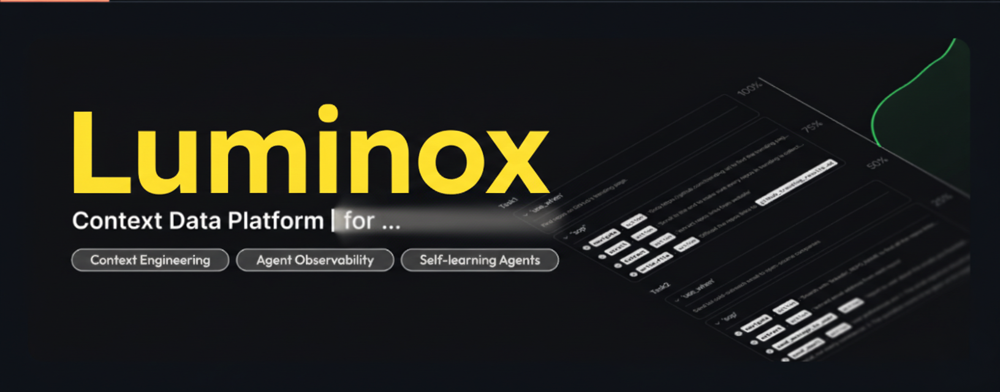
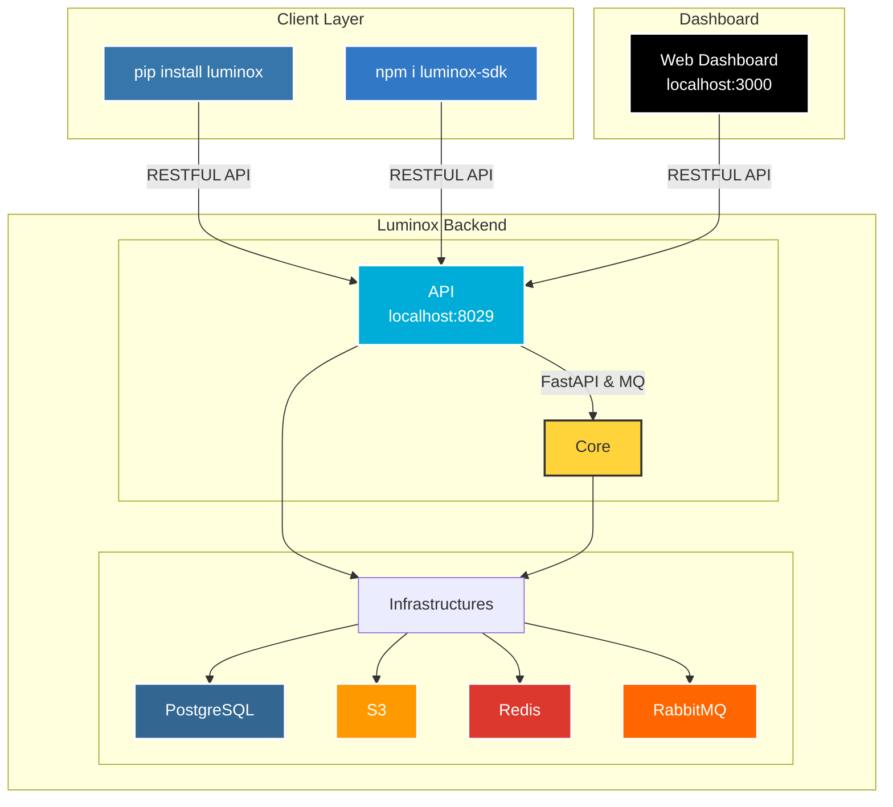
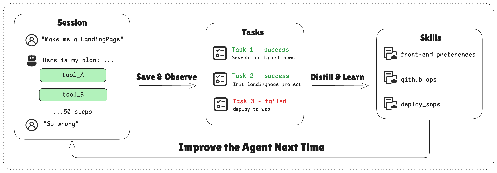
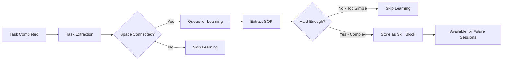

<div align="center">
  <a href="https://discord.luminox.io">
      
  </a>
  <p>
    <h4>Context Data Platform for Building Cloud-native AI Agents</h4>
  </p>
  <p align="center">
    <a href="https://pypi.org/project/luminox/"></a>
    <a href="https://www.npmjs.com/package/luminox"></a>
    <a href="https://github.com/memodb-io/luminox/actions/workflows/core-test.yaml"></a>
    <a href="https://github.com/memodb-io/luminox/actions/workflows/api-test.yaml"></a>
    <a href="https://github.com/memodb-io/luminox/actions/workflows/cli-test.yaml"></a>
  </p>
  <p align="center">
    <a href="https://x.com/luminox_io"></a>
    <a href="https://discord.luminox.io"></a>
  </p>
  <div align="center">
    <!-- Keep these links. Translations will automatically update with the README. -->
    <a href="../../readme/de/README.md">Deutsch</a> | 
    <a href="../../readme/es/README.md">Español</a> | 
    <a href="../../readme/fr/README.md">Français</a> | 
    <a href="../../readme/ja/README.md">日本語</a> | 
    <a href="../../readme/ko/README.md">한국어</a> | 
    <a href="../../readme/pt/README.md">Português</a> | 
    <a href="../../readme/ru/README.md">Русский</a> | 
    <a href="../../readme/zh/README.md">中文</a>
  </div>
  <br/>
</div>


*Todos te dicen cómo usar sus agentes. Pero si TÚ necesitas construir un agente para 100,000 usuarios, ¿por dónde empezarías?*

**📦 Problema 1: El 99% de tu DB son mensajes LLM.** 

> Un diseño de esquema deficiente hace que tus datos más valiosos sean costosos y lentos. Luminox maneja el almacenamiento y recuperación de contexto via PG, Redis y S3.
>
> ChatGPT, Gemini, Anthropic, imágenes, audio, archivos... te tenemos cubierto.

**⏰ Problema 2: Los agentes de larga duración son una pesadilla.** 

> Conoces la ingeniería de contexto, pero siempre la escribes desde cero. Luminox viene con métodos de edición de contexto integrados y un todo agent listo para usar.
>
> ¿Gestionar el estado del agente? Pan comido.

**👀 Problema 3: No puedes ver cómo está funcionando tu agente.** 

> ¿Qué tan satisfechos están realmente tus usuarios? Luminox rastrea las tareas por sesión y te muestra la tasa de éxito real de tu agente.
>
> Deja de obsesionarte con los costos de tokens, mejora el agente primero.

**🧠 Problema 4: Tu agente es impredecible.**

> ¿Puede aprender de sus éxitos? El experience agent de Luminox recuerda las ejecuciones exitosas y las convierte en SOPs de uso de herramientas reutilizables.
>
> La consistencia lo es todo.


Para resolver estos problemas de una vez, Luminox se convierte en la **Plataforma de Datos de Contexto**:

<div align="center">
    <picture>
      
    </picture>
  <p>Plataforma de Datos de Contexto que Almacena, Observa y Aprende</p>
</div>


# 💡 Características Principales

- **Context Engineering**
  - [Session](https://docs.luminox.io/store/messages/multi-provider): almacenamiento de mensajes unificado para cualquier LLM, cualquier modalidad.
  - [Disk](https://docs.luminox.io/store/disk): guardar/descargar artifacts con ruta de archivo.
  - [Context Editing](https://docs.luminox.io/store/editing) - gestiona tu ventana de contexto en una API.

<div align="center">
    <picture>
      
    </picture>
  <p>Context Engineering en Luminox</p>
</div>

- **Observar tareas del agente y retroalimentación del usuario**
  - [Task](https://docs.luminox.io/observe/agent_tasks): recopilar el estado de trabajo del agente, progreso y preferencias en tiempo casi real.
- **Auto-aprendizaje del agente**
  - [Experience](https://docs.luminox.io/learn/advance/experience-agent): deja que el agente aprenda SOPs para cada usuario.
- **Ver todo en un [dashboard](https://docs.luminox.io/observe/dashboard)**

<div align="center">
    <picture>
      
    </picture>
  <p>Dashboard de Tasa de Éxito del Agent y Otras Métricas</p>
</div>


# 🏗️ ¿Cómo funciona?

<details>
<summary>clic para abrir</summary>



## Cómo Trabajan Juntos

```txt
┌──────┐    ┌────────────┐    ┌──────────────┐    ┌───────────────┐
│ User │◄──►│ Your Agent │◄──►│   Session    │    │ Artifact Disk │
└──────┘    └─────▲──────┘    └──────┬───────┘    └───────────────┘
                  │                  │ # if enable
                  │         ┌────────▼────────┐
                  │         │ Observed Tasks  │
                  │         └────────┬────────┘
                  │                  │ # if enable
                  │         ┌────────▼────────┐
                  │         │   Learn Skills  │
                  │         └────────┬────────┘
                  └──────────────────┘
                      Search skills
```


## Estructuras de Datos

<details>
<summary>📖 Estructura de Tarea</summary>

```json
{
  "task_description": "Star https://github.com/memodb-io/Luminox",
  "progresses": [
    "I have navigated to Luminox repo",
    "Tried to Star but a pop-up required me to login",
    ...
  ],
  "user_preferences": [
    "user wants to use outlook email to login"
  ]
}
```
</details>


<details>
<summary>📖 Estructura de Habilidad</summary>


```json
{
    "use_when": "star a repo on github.com",
    "preferences": "use user's outlook account",
    "tool_sops": [
        {"tool_name": "goto", "action": "goto github.com"},
        {"tool_name": "click", "action": "find login button if any. login first"},
        ...
    ]
}
```

</details>


<details>
<summary>📖 Estructura de Space</summary>

```txt
/
└── github/ (folder)
    └── GTM (page)
        ├── find_trending_repos (sop)
        └── find_contributor_emails (sop)
    └── basic_ops (page)
        ├── create_repo (sop)
        └── delete_repo (sop)
    ...
```
</details>

</details>


# 🚀 Conectar a Luminox

1. Ve a [Luminox.io](https://luminox.io), reclama tus créditos gratis.
2. Pasa por un onboarding de un clic para obtener tu API Key: `sk-ac-xxx`

<div align="center">
    <picture>
      
    </picture>
</div>


<details>
<summary>💻 Auto-alojar Luminox</summary>

Tenemos un `luminox-cli` para ayudarte a hacer una prueba de concepto rápida. Descárgalo primero en tu terminal:

```bash
curl -fsSL https://install.luminox.io | sh
```

Deberías tener [docker](https://www.docker.com/get-started/) instalado y una OpenAI API Key para iniciar un backend de Luminox en tu computadora:

```bash
mkdir luminox_server && cd luminox_server
luminox docker up
```

> [!IMPORTANT]
>
> Asegúrate de que tu LLM tenga la capacidad de [llamar herramientas](https://platform.openai.com/docs/guides/function-calling). Por defecto, Luminox usará `gpt-4.1`.

`luminox docker up` creará/usará `.env` y `config.yaml` para Luminox, y creará una carpeta `db` para persistir datos.


Una vez completado, puedes acceder a los siguientes endpoints:

- Luminox API Base URL: http://localhost:8029/api/v1
- Luminox Dashboard: http://localhost:3000/

</details>


# 🧐 Usar Luminox para construir Agent

Descarga scripts de extremo a extremo con `luminox`:

**Python**

```bash
luminox create my-proj --template-path "python/openai-basic"
```

> Más ejemplos en Python:
>
> - `python/openai-agent-basic`: agent de auto-aprendizaje en openai agent sdk.
> - `python/agno-basic`: agent de auto-aprendizaje en agno framework.
> - `python/openai-agent-artifacts`: agent que puede editar y descargar artifacts.

**Typescript**

```bash
luminox create my-proj --template-path "typescript/openai-basic"
```

> Más ejemplos en Typescript:
>
> - `typescript/vercel-ai-basic`: agent de auto-aprendizaje en @vercel/ai-sdk


> [!NOTE]
>
> Consulta nuestro repositorio de ejemplos para más plantillas: [Luminox-Examples](https://github.com/memodb-io/Luminox-Examples).
>
> ¡Estamos preparando más aplicaciones Agent full-stack! [¡Dinos lo que quieres!](https://discord.luminox.io)


## Inicio Rápido Paso a Paso

<details>
<summary>Haz clic para abrir</summary>


Mantenemos SDKs de Python [](https://pypi.org/project/luminox/) y Typescript [](https://www.npmjs.com/package/luminox). Los fragmentos de código a continuación usan Python.

## Instalar SDKs

```
pip install luminox # for Python
npm i luminox-sdk # for Typescript
```


## Inicializar Cliente

```python
import os
from luminox import LuminoxClient

client = LuminoxClient(
    api_key=os.getenv("LUMINOX_API_KEY"),
)

# Si estás usando Luminox auto-alojado:
# client = LuminoxClient(
#     base_url="http://localhost:8029/api/v1",
#     api_key="sk-ac-your-root-api-bearer-token",
# )
```

> [📖 async client doc](https://docs.luminox.io/settings/core)


## Almacenar

Luminox puede gestionar sesiones de agents y artifacts.

### Guardar Mensajes [📖](https://docs.luminox.io/api-reference/session/store-message-to-session)

Luminox ofrece almacenamiento persistente para datos de mensajes. Cuando llamas a `session.store_message`, Luminox persistirá el mensaje y comenzará a monitorear esta sesión:

<details>
<summary>Fragmento de Código</summary>

```python
session = client.sessions.create()

messages = [
    {"role": "user", "content": "I need to write a landing page of iPhone 15 pro max"},
    {
        "role": "assistant",
        "content": "Sure, my plan is below:\n1. Search for the latest news about iPhone 15 pro max\n2. Init Next.js project for the landing page\n3. Deploy the landing page to the website",
    }
]

# Save messages
for msg in messages:
    client.sessions.store_message(session_id=session.id, blob=msg, format="openai")
```

> [📖](https://docs.luminox.io/store/messages/multi-modal) También soportamos almacenamiento de mensajes multi-modal y SDK de anthropic.


</details>

### Cargar Mensajes [📖](https://docs.luminox.io/api-reference/session/get-messages-from-session)

Obtén los mensajes de tu sesión usando `sessions.get_messages`

<details>
<summary>Fragmento de Código</summary>

```python
r = client.sessions.get_messages(session.id)
new_msg = r.items

new_msg.append({"role": "user", "content": "How are you doing?"})
r = openai_client.chat.completions.create(model="gpt-4.1", messages=new_msg)
print(r.choices[0].message.content)
client.sessions.store_message(session_id=session.id, blob=r.choices[0].message)
```

</details>

<div align="center">
    <picture>
      
    </picture>
  <p>Puedes ver sesiones en tu Dashboard local</p>
</div>


### Artifacts [📖](https://docs.luminox.io/store/disk)

Crea un disco para tu agent para almacenar y leer artifacts usando rutas de archivos:

<details>
<summary>Fragmento de Código</summary>

```python
from luminox import FileUpload

disk = client.disks.create()

file = FileUpload(
    filename="todo.md",
    content=b"# Sprint Plan\n\n## Goals\n- Complete user authentication\n- Fix critical bugs"
)
artifact = client.disks.artifacts.upsert(
    disk.id,
    file=file,
    file_path="/todo/"
)


print(client.disks.artifacts.list(
    disk.id,
    path="/todo/"
))

result = client.disks.artifacts.get(
    disk.id,
    file_path="/todo/",
    filename="todo.md",
    with_public_url=True,
    with_content=True
)
print(f"✓ File content: {result.content.raw}")
print(f"✓ Download URL: {result.public_url}")        
```
</details>


<div align="center">
    <picture>
      
    </picture>
  <p>Puedes ver Artifacts en tu Dashboard local</p>
</div>


## Observar [📖](https://docs.luminox.io/observe)

Para cada sesión, Luminox **automáticamente** lanzará un agent en segundo plano para rastrear el progreso de la tarea y la retroalimentación del usuario. **Es como un agent TODO en segundo plano**. Luminox lo usará para observar tu tasa de éxito diaria del agent.

Puedes usar el SDK para recuperar el estado actual de la sesión del agent, para Context Engineering como Reducción y Compresión. 

<details>
<summary>Script Completo</summary>

```python
from luminox import LuminoxClient

# Initialize client
client = LuminoxClient(
    base_url="http://localhost:8029/api/v1", api_key="sk-ac-your-root-api-bearer-token"
)

# Create a project and session
session = client.sessions.create()

# Conversation messages
messages = [
    {"role": "user", "content": "I need to write a landing page of iPhone 15 pro max"},
    {
        "role": "assistant",
        "content": "Sure, my plan is below:\n1. Search for the latest news about iPhone 15 pro max\n2. Init Next.js project for the landing page\n3. Deploy the landing page to the website",
    },
    {
        "role": "user",
        "content": "That sounds good. Let's first collect the message and report to me before any landing page coding.",
    },
    {
        "role": "assistant",
        "content": "Sure, I will first collect the message then report to you before any landing page coding.",
      	"tool_calls": [
            {
                "id": "call_001",
                "type": "function",
                "function": {
                    "name": "search_news",
                    "arguments": "{\"query\": \"iPhone news\"}"
                }
            }
        ]
    },
]

# Store messages in a loop
for msg in messages:
    client.sessions.store_message(session_id=session.id, blob=msg, format="openai")

# Wait for task extraction to complete
client.sessions.flush(session.id)

# Display extracted tasks
tasks_response = client.sessions.get_tasks(session.id)
print(tasks_response)
for task in tasks_response.items:
    print(f"\nTask #{task.order}:")
    print(f"  ID: {task.id}")
    print(f"  Title: {task.data.task_description}")
    print(f"  Status: {task.status}")

    # Show progress updates if available
    if task.data.progresses:
        print(f"  Progress updates: {len(task.data.progresses)}")
        for progress in task.data.progresses:
            print(f"    - {progress}")

    # Show user preferences if available
    if task.data.user_preferences:
        print("  User preferences:")
        for pref in task.data.user_preferences:
            print(f"    - {pref}")

```
> `flush` es una llamada bloqueante, esperará a que se complete la extracción de tareas.
> No necesitas llamarlo en producción, Luminox tiene un [mecanismo de buffer](https://docs.luminox.io/observe/buffer) para asegurar que la extracción de tareas se complete en el momento adecuado.

</details>

Ejemplo de Retorno de Tarea:

```txt
Task #1:
  Title: Search for the latest news about iPhone 15 Pro Max and report findings to the user before any landing page coding.
  Status: success
  Progress updates: 2
    - I confirmed that the first step will be reporting before moving on to landing page development.
    - I have already collected all the iPhone 15 pro max info and reported to the user, waiting for approval for next step.
  User preferences:
    - user expects a report on latest news about iPhone 15 pro max before any coding work on the landing page.

Task #2:
  Title: Initialize a Next.js project for the iPhone 15 Pro Max landing page.
  Status: pending

Task #3:
  Title: Deploy the completed landing page to the website.
  Status: pending
```


Puedes ver los estados de las tareas de sesión en el Dashboard:

<div align="center">
    <picture>
      
    </picture>
  <p>Una Demostración de Tarea</p>
</div>


## Auto-aprendizaje

Luminox puede recopilar un montón de sesiones y aprender habilidades (SOPs) sobre cómo llamar herramientas para ciertas tareas.

### Aprender Habilidades a un `Space` [📖](https://docs.luminox.io/learn/skill-space)

<div align="center">
    <picture>
      
    </picture>
  <p>¿Cómo funciona el auto-aprendizaje?</p>
</div>

Un `Space` puede almacenar habilidades y recuerdos en un sistema similar a Notion. Primero necesitas conectar una sesión a `Space` para habilitar el proceso de aprendizaje:

```python
# Step 1: Create a Space for skill learning
space = client.spaces.create()
print(f"Created Space: {space.id}")

# Step 2: Create a session attached to the space
session = client.sessions.create(space_id=space.id)

# ... push the agent working context
```

El aprendizaje ocurre en segundo plano y no es en tiempo real (retraso alrededor de 10-30 segundos). 

Lo que Luminox hará en segundo plano:



Finalmente, los bloques SOP con patrón de llamada de herramienta se guardarán en `Space`. Puedes ver cada `Space` en el Dashboard:

<div align="center">
    <picture>
      
    </picture>
  <p>Una Demostración de Space</p>
</div>


### Buscar Habilidades desde un `Space` [📖](https://docs.luminox.io/learn/search-skills)

Para buscar habilidades desde un `Space` y usarlas en la próxima sesión:

```python
result = client.spaces.experience_search(
    space_id=space.id,
    query="I need to implement authentication",
  	mode="fast"
)
```

Luminox soporta modos `fast` y `agentic` para la búsqueda. El primero usa embeddings para coincidir habilidades. El segundo usa un Experience Agent para explorar todo el `Space` e intenta cubrir cada habilidad necesaria.

El retorno es una lista de bloques sop, que se ven así:

```json
{
    "use_when": "star a github repo",
    "preferences": "use personal account. star but not fork",
    "tool_sops": [
        {"tool_name": "goto", "action": "goto the user given github repo url"},
        {"tool_name": "click", "action": "find login button if any, and start to login first"},
        ...
    ]
}
```

</details>


# 🔍 Documentación

Para entender mejor lo que Luminox puede hacer, por favor consulta [nuestra documentación](https://docs.luminox.io/)


# ❤️ Mantente Actualizado

Marca Luminox con una estrella en Github para apoyar y recibir notificaciones instantáneas 


# 🤝 Mantente Conectado

Únete a la comunidad para obtener apoyo y discusiones:

-   [Discute con Constructores en Luminox Discord](https://discord.luminox.io) 👻 
-  [Sigue a Luminox en X](https://x.com/luminox_io) 𝕏 


# 🌟 Contribuir

- Revisa primero nuestro [roadmap.md](../../ROADMAP.md).
- Lee [contributing.md](../../CONTRIBUTING.md)


# 📑 LICENCIA

Este proyecto está actualmente licenciado bajo [Apache License 2.0](LICENSE).


# 🥇 Insignias

 

```md
[](https://luminox.io)

[](https://luminox.io)
```
